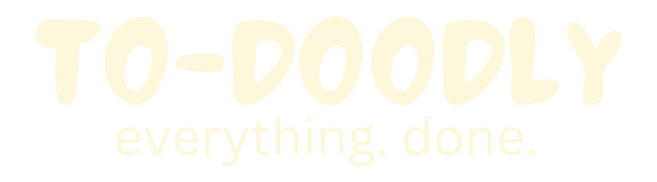
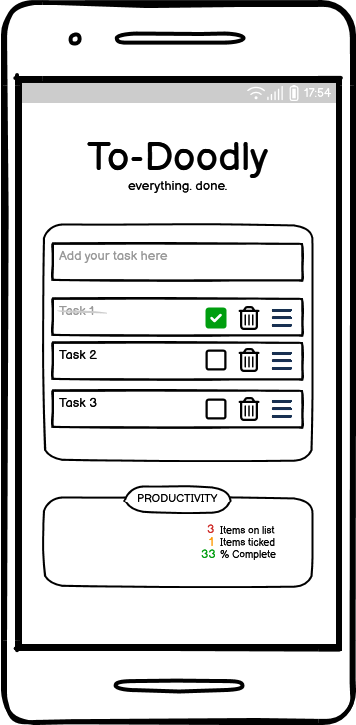
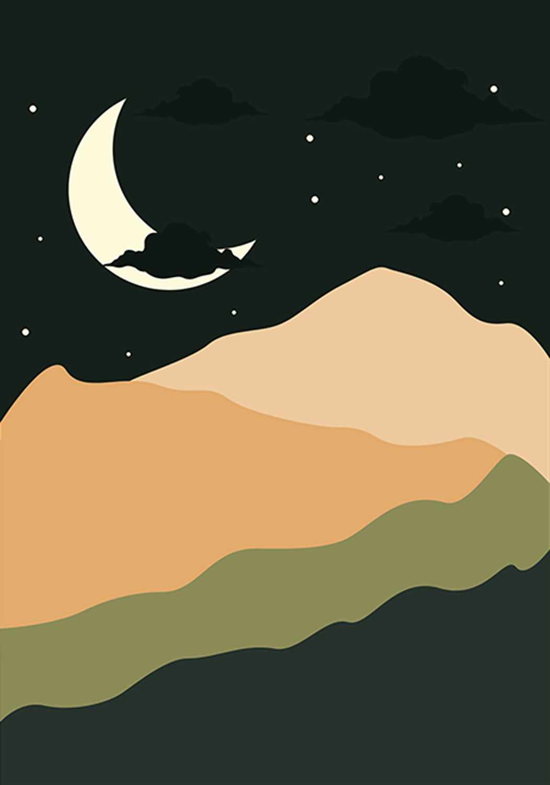

# Project Name - To-Doodly

* Final Screenshots create on - https://ui.dev/amiresponsive
  
* [Link to Deployed Project](https://rstan-dev.github.io/P2-To-Doodly/)
* Gitpod: use `python -m http.server` to preview in server

## Contents(#contents)
​
* [User Experience (UX)](#user-experience)
    *  [Purpose & target audience](#purpose-and-target-audience)
    *  [User Story](#user-story)
* [Design](#design)
  * [Wireframes](#wireframes)  
  * [Color Scheme](#color-scheme)
  * [Typography](#typography)
  * [Imagery](#imagery)
  * [MVP](#mvp)
  * [Planned features](#planned-features)
* [Technology](#technology)
* [Deployment](#deployment)
* [Testing](#testing)
  * [Tests performed](#tests-performed)
  * [Bugs resolved](#bugs-resolved)
  * [Unresolved bugs](#unresolved-bugs)
  * [Improvements & future developments](#improvements-and-future-developments)
* [Credits](#credits)
  * [Code](#code)
  * [Content](#content)
  * [Media](#media)
  * [Acknowledgements](#acknowledgements)

 ## User Experience
   ### Purpose and target audience
   * This useful To Do List was created as a simple way to to encourage people to stay organised and keep ontop of their tasks.  Suitable for all ages this to do list has a fun modern interface.

   ### User Story
   * The user has one screen and simple intuitive navigation.  The logo at the top is self-explanatory in a fun bubble font.  The user is encouraged to enter something to do in the input box and on hitting enter the task is added to the list below.  There is square icon, which when clicked turns into a green tick and strikes out the task showing that it has been done.  The user can click the trach icon to delete the item or they can re-order the list using the bars icon on the right hand side.

   The list has been deisgned to show 5 items - in order to kep it on one screen, and any more items on the list can be accessed by using the scroll bar on the right.

   Below the task list is a Producivity area.  This keeps a counter of how many items are on the list, how many items are ticked on the list, and a % completion.

## Design
The app was conceived in Balsamiq and then designed in Canva, and the final product is very close to the original design
   ### Wireframes
   Desktop
   

   Mobile
   

   ### Color Scheme
   * A black and cream color scheme was chosen for clear contrast.  White input and task area defines that task list and a green tick box was used to clearly identify what has been done.  Traffic light colors were used in the counter numbers within the productivity area.

   
 
   ### Typography
   *  The main text font is Roboto from Google Fonts chosen for its easy readability, with sans-serif as a backup. Caveat Brush from google fonts was chosen as a fun header for the productivity area.

   ### Imagery
   * The app uses one background image which is a royalty free template from Canva.
     

   ### MVP
   * The minimum viable product was to have a functioning todo list that could add an item, tick and item as done and delete the item.  The items needed to be saved to local storage so they would still be available when the app was reloaded.

   ### Planned features
   * 

## Technology
   * HTML
   * CSS
   * Javascript

## Deployment
The following steps were taken to deploy this site:

1. The project was originally set up in an online repo on GitHub, with some test pages and an example modal created
2.  The project was immediately deployed to git pages, to ensure there would be no deployment issues
3. Under settings/pages, the main branch was selected as the source
4. Each developer worked on a separate branch from the main
5. The project was edited in VS code in a local dev area  
6. Regular commits were added with descriptive commit messages
7. Commits were pushed to GitHub regularly.  Branches were merged with the main branch regularly, ensuring all merge conflicts were easily resolved.  
8. Link to live site: 

## Testing

### Tests performed
The following tests were performed on the app
  * W3C HTML validation
  

  * W3C CSS Validation
  

  * Lighthouse Test
  

  * Manual testing of all the links
 
### Bugs resolved:
* 

### Unresolved bugs:
* 
 ### Improvements and future developments
* 
## Credits
  ### Code
  * 
  ### Content
  * 
  ### Media
  * 
  ### Acknowledgements
  * 

